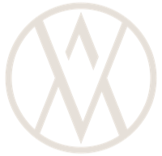
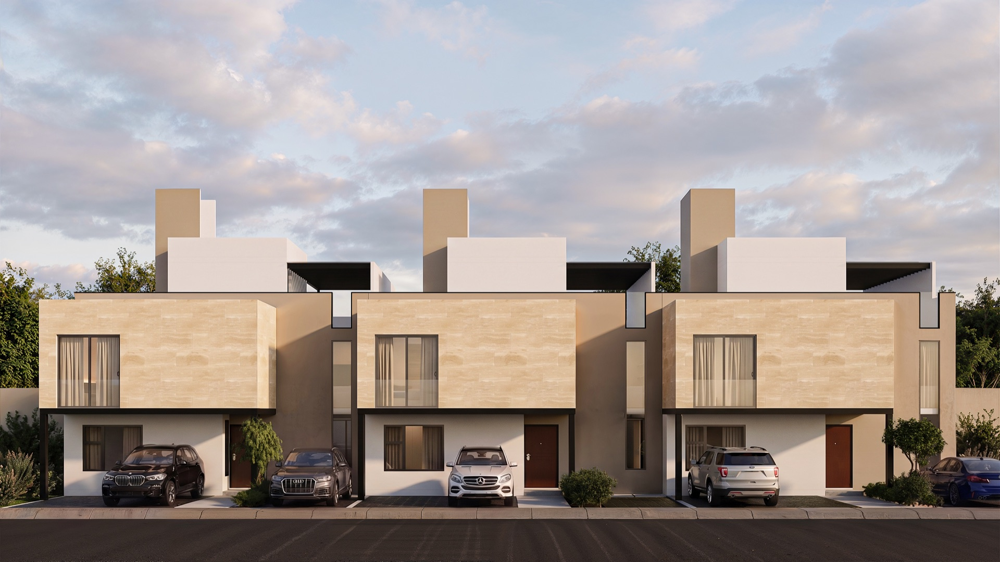
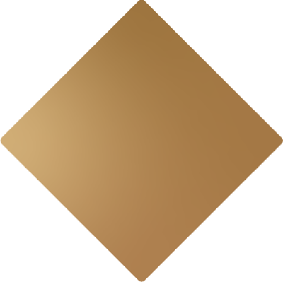
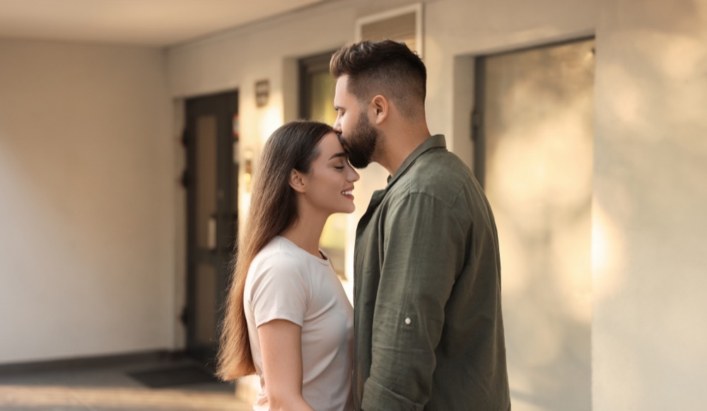

# XATIVA — Pestaña "Casas" · Especificación de diseño (extraída del .fig)

Réplica fiel del Figma "XATIVA CASAS" (frame 1335:284 + 3 vistas de detalle).
Diseño desktop base: **1280px de ancho**. Hacer responsive (breakpoints ~1024 / 768 / 480).
Sitio estático: HTML + CSS + JS vanilla, sin frameworks. Idioma: español (lang="es").

## Propiedad de archivos (no tocar archivos de otro agente)
- Agente MAIN: `css/base.css`, `css/main.css`, `index.html`, `js/main.js`
- Agente DETAIL: `casa-onix.html`, `casa-jade.html`, `casa-cuarzo.html`, `css/detail.css`, `js/detail.js`
- Agente ASSETS: todo bajo `assets/`

DETAIL enlaza `css/base.css` + `css/detail.css`. Las clases compartidas (navbar, hero,
amenidades, contacto, footer, botones, flotantes) viven en `base.css` y DETAIL las usa
tal cual del contrato de abajo SIN redefinirlas (solo añade lo específico de detalle).

## Paleta
```css
:root{
  --dark:   #21262d;  /* azul-gris oscuro: textos, fondos oscuros */
  --cream:  #e6e1db;  /* crema: fondos claros, texto sobre oscuro */
  --gold:   #bc935e;  /* dorado principal: navbar, acentos, botones */
  --gold-2: #cea876;  /* dorado claro decorativo */
  --bronze: #aa7336;  /* bronce del arte del logo */
  --white:  #ffffff;
}
```

## Tipografías (archivos en assets/fonts/, @font-face en base.css)
- `Neutra Text` Bold → `assets/fonts/NeutraText-Bold.otf` (weight 700)
- `Neutra Text Book Alt` → `assets/fonts/NeutraText-BookAlt.otf` (weight 400)
- `Neutra Text` Light → `assets/fonts/NeutraText-Light.otf` (weight 300)
- `Fahkwang` Light 300 / Regular 400 / Medium 500 / Bold 700 → `assets/fonts/Fahkwang-*.ttf`

Usos: H1/H2 = Neutra Text Bold (70px hero / 50px secciones / 34px títulos de tarjeta,
line-height 1.0). Etiquetas tipo "Planta Baja"/"Cocina" = Neutra Text Book Alt (24px, o 17px
en tarjetas), color según contexto. Cuerpo/botones/nav = Fahkwang Regular 15–17px.
Precios = Fahkwang Bold 32px dorado. m² = Fahkwang Light 22–32px.

## Assets (nombres fijos — contrato)
```
assets/img/hero-bg.jpg              fondo hero 1280x720 (fachada)
assets/img/logo-xativa.png          logotipo navbar (37x36)
assets/img/logo-diamond.png         monograma diamante decorativo del hero (186x186, esquina sup. der.)
assets/img/plan-onix-baja.png       planta baja Onix/Cuarzo
assets/img/plan-onix-alta.png       planta alta Onix/Cuarzo
assets/img/plan-cuarzo-baja.png     = misma imagen que onix-baja (existe con ambos nombres)
assets/img/plan-cuarzo-alta.png     = misma imagen que onix-alta
assets/img/plan-cuarzo-roof.png     planta roof garden Cuarzo
assets/img/plan-jade-sotano.png     sótano Jade
assets/img/plan-jade-baja.png       planta baja Jade
assets/img/plan-jade-alta.png       planta alta Jade
assets/img/gallery-jade-cocina.jpg  galería: Jade / Cocina (1340x599 aprox)
assets/img/gallery-cuarzo-rooftop.jpg galería: Cuarzo / Rooftop
assets/img/gallery-onix-recamara.jpg  galería: Onix / Recámara
assets/img/contact-photo.jpg        foto pareja sección contacto (475x680)
assets/video/hero.mp4               video para el modal "Ver video"
```

## Iconos
No hay SVGs exportables limpios en el .fig. Usar SVG inline sencillos (stroke/fill según contexto):
- Flechas de tarjeta: chevron arriba/abajo (fill --dark).
- Flechas de galería: chevrones < > gruesos (fill --cream).
- Play "Ver video": círculo con borde 2px --cream + triángulo --cream.
- Amenidades (fill/stroke --gold, dentro de círculo 132px con borde 1px --cream):
  basquetbol (balón), usos mixtos (cancha/red), ciclopista (bicicleta), juegos (columpio).
- Redes en footer: Facebook e Instagram (fill --dark, 23px).
- Flotantes: teléfono y mail (cuadrados 32px fondo --gold, icono --cream);
  WhatsApp (cuadrado 32px fondo #25d366, icono --cream).

## SNIPPETS COMPARTIDOS (usar este markup EXACTO en todas las páginas)

### Navbar (fija arriba, alto 54px, fondo --gold)
```html
<header class="navbar">
  <a class="navbar__logo" href="index.html"></a>
  <nav class="navbar__nav">
    <a href="#" class="navbar__link">Inicio</a>
    <a href="index.html" class="navbar__link navbar__link--active">Casas en venta</a>
    <a href="#amenidades" class="navbar__link">Amenidades</a>
    <a href="#ubicacion" class="navbar__link">Ubicación</a>
    <a href="#contacto" class="navbar__link">Contacto</a>
  </nav>
  <button class="navbar__toggle" aria-label="Menú">≡</button>
</header>
```
Links: Fahkwang 15px --cream, gap ~44px, alineados a la derecha con padding 27px;
"Casas en venta" en bold (activo). Logo a la izquierda (padding-left 21px). Navbar fixed,
contenido con scroll debajo. En detalle, mismo navbar (los anchors # van a index.html#...).

### Botón outline (hero y "Enviar")
```html
<a class="btn-outline" href="#contacto">Más información</a>
```
192x46 (Enviar: 496x46 full-width del form), borde 1px --cream (variante sobre claro:
--dark), texto Fahkwang 15px --cream, fondo transparente. Hover: fondo --cream y texto
--dark (transición suave, en el fig es un degradado dark→cream).

### Flotantes laterales (derecha, centrados verticalmente, fixed)
```html
<div class="floating">
  <a class="floating__btn floating__btn--tel" href="tel:5512345678" aria-label="Llamar">[svg tel]</a>
  <a class="floating__btn floating__btn--mail" href="#contacto" aria-label="Escribir">[svg mail]</a>
  <a class="floating__btn floating__btn--wa" href="https://wa.me/525512345678" aria-label="WhatsApp">[svg whatsapp]</a>
</div>
```
32x32 cada uno, gap 6px (WhatsApp separado 36px extra abajo).

### Hero (alto 720px)
```html
<section class="hero">
  
  <div class="hero__overlay"></div>
  
  <div class="hero__content">
    <h1 class="hero__title">CASAS EN PREVENTA<br>CON DISEÑO EXCLUSIVO</h1>
    <p class="hero__text">Disfruta de un hogar creado con arquitectura contemporánea y espacios funcionales en Lomas de Juriquilla.</p>
    <a class="btn-outline" href="#modelos">Más información</a>
    <button class="hero__video-btn" data-video="assets/video/hero.mp4">[svg play] Ver video</button>
  </div>
  <div class="hero__scroll">Scroll to explore [svg flecha abajo]</div>
</section>
```
Overlay negro ~40%. Título Neutra Bold 70px --cream a x=80px, y≈237. Texto 17px máx 615px.
Botón y=491. "Ver video" (Fahkwang 15px --cream + play 42px) a la derecha del contenido
(x≈325 del borde izq. del bloque de video según fig: colócalo bajo el botón o a su derecha,
alineado con la esquina inferior del bloque de texto). "Scroll to explore" centrado abajo
(Fahkwang 14px --cream, opacity .5). Diamante 186px esquina derecha (y=189, pegado al borde der.).
En páginas de detalle el H1 es: `CASAS CON DISEÑO EXCLUSIVO` y el texto añade "en la zona de".
El modal de video: overlay oscuro, <video controls autoplay>, cerrar con X y clic fuera.

### Amenidades (banda --dark, alto 470px) — id="amenidades"
```html
<section class="amenities" id="amenidades">
  <h2 class="amenities__title">AMENIDADES DE LOMAS DE JURIQUILLA</h2>
  <div class="amenities__grid">
    <div class="amenity"><div class="amenity__circle">[svg]</div><p>Canchas de<br>Básquetbol</p></div>
    <div class="amenity"><div class="amenity__circle">[svg]</div><p>Canchas de<br>Usos Mixtos</p></div>
    <div class="amenity"><div class="amenity__circle">[svg]</div><p>Ciclopista</p></div>
    <div class="amenity"><div class="amenity__circle">[svg]</div><p>Área<br>de Juegos</p></div>
  </div>
</section>
```
Título Neutra Bold 50px --cream centrado (y=76 dentro de la banda). Círculos 132px borde
1px --cream, icono dorado ~50px dentro. Etiquetas Neutra Book Alt 24px --cream centradas.
4 columnas centradas (gap ~130px entre centros).

### Contacto + footer (fondo --cream) — id="contacto"
```html
<section class="contact" id="contacto">
  <div class="contact__top">
    <div class="contact__art">[imagen logo-diamond.png grande, opacity ~.9]</div>
    <h2 class="contact__title">TU FUTURO RESIDENCIAL<br>ESTÁ EN XÂTIVA</h2>
  </div>
  <div class="contact__body">
    <form class="contact__form">
      <p class="contact__lead">Para más información déjanos tus datos y un asesor te contará en breve.</p>
      <input type="text" placeholder="Nombre*" required>
      <div class="contact__row">
        <input type="email" placeholder="Correo*" required>
        <input type="tel" placeholder="Teléfono*" required>
      </div>
      <input type="text" placeholder="Mensaje">
      <button class="btn-outline btn-outline--dark" type="submit">Enviar</button>
    </form>
    
  </div>
  <div class="contact__info" id="ubicacion">
    <hr class="contact__hr">
    <div class="contact__cols">
      <div><h4>Ubicación</h4><p>Lomas de Juriquilla,<br>Querétaro</p></div>
      <div><h4>Contacto</h4><p>55 1234 5678</p></div>
      <div><h4>Síguenos</h4><p class="contact__social">[svg fb] [svg ig]</p></div>
    </div>
  </div>
</section>
<footer class="footer"></footer>
```
Título Neutra Bold 50px --dark (arriba derecha del arte, y≈55). Arte diamante grande a la
izquierda (~640px). Lead Fahkwang 17px --dark máx 349px. Inputs: 49px alto, borde 1px
--gold al 30%, fondo transparente, placeholder Fahkwang 17px --gold, padding-left 20px.
Fila correo+teléfono: 2 columnas 233px c/u con gap. Form ancho 496px, columna derecha del
layout (foto 475x680 a su derecha). h4 Fahkwang Bold 17px --gold; p Fahkwang 15px --dark.
Línea hr 1px --gold ancho 570px alineada izq. de las columnas. `.footer`: barra --dark alto 65px.

## INDEX.HTML (frame 1335:284) — orden de secciones
1. Navbar
2. Hero (H1 "CASAS EN PREVENTA / CON DISEÑO EXCLUSIVO")
3. Intro centrada (fondo blanco, py ~80px):
   - H2 "XÂTIVA ES TU ESPACIO" (Neutra Bold 50px --dark, centrado)
   - p "Contamos con tres opciones de vivienda de 3 recámaras desde $5.94 MXN." (Fahkwang 17px)
4. Modelos — id="modelos":
   - H2 "Modelos disponibles" (Neutra Bold 50px **--gold**, alineado al margen izq. del grid, x≈420 abs → colócalo sobre la primera… en el fig está desplazado; usar margen izquierdo del contenedor centrado)
   - Grid de 3 tarjetas (371x567, gap 24px, centrado):
     ORDEN: Casa Onix | Casa Jade | Casa Cuarzo
   - Tarjeta (fondo blanco, borde 1px --gold 60%):
     * fila sup: título Neutra Bold 34px --dark izq + m² Fahkwang Light 22px der (Onix 227m² / Jade 287m² / Cuarzo 323m²)
     * etiqueta de planta (Neutra Book Alt 17px --gold) — cambia con las flechas
     * imagen de planta ~350x350 (object-fit contain)
     * flechas chevron 25px: izquierda-abajo (anterior) y derecha-arriba (siguiente), fill --dark
     * fila botones: "Más información" (167x30, fondo --dark, texto --cream 15px → enlaza a casa-X.html)
       + "Cotizar" (122x29, fondo --gold, texto --cream → enlaza a #contacto)
   - Plantas por tarjeta (JS rota imagen + etiqueta):
     Onix: Planta Baja (plan-onix-baja.png), Planta Alta (plan-onix-alta.png)
     Jade: Sótano (plan-jade-sotano.png), Planta Baja (plan-jade-baja.png), Planta Alta (plan-jade-alta.png)
     Cuarzo: Roof Garden (plan-cuarzo-roof.png), Planta Alta (plan-cuarzo-alta.png), Planta Baja (plan-cuarzo-baja.png)
5. Galería (carrusel full-width, alto 599px, imagen cover + gradiente oscuro abajo):
   Slides: [Jade/Cocina → gallery-jade-cocina.jpg], [Cuarzo/Rooftop → gallery-cuarzo-rooftop.jpg],
   [Onix/Recámara → gallery-onix-recamara.jpg]
   - Chip nombre casa: caja --cream 321x71 arriba-derecha (y≈110 dentro de la sección),
     texto Neutra Bold 36px --dark centrado ("Casa Jade").
   - Caption abajo-izquierda: Neutra Book Alt 24px --cream ("Cocina"), x≈70, y≈540.
   - Flechas < > abajo-derecha (x≈1077, cream, 94px de ancho el grupo).
   - Auto-rotar cada 6s + flechas manuales.
6. Amenidades (snippet)
7. Contacto + footer (snippet)
8. Flotantes (snippet)

## PÁGINAS DE DETALLE (casa-cuarzo.html, casa-jade.html, casa-onix.html)
Estructura (frames 1341:6371 Cuarzo / 1341:8314 Jade / 1388:808 Onix), tras navbar+hero:
1. Hero igual pero H1 "CASAS CON DISEÑO EXCLUSIVO" y texto "…funcionales en la zona de Lomas de Juriquilla."
2. Intro: "XÂTIVA ES TU ESPACIO" + p:
   - Cuarzo/Jade: "Contamos con tres opciones de vivienda de 3 recámaras desde $5.94 MXN."
   - Onix: "Contamos con dos opciones de vivienda de 3 recámaras."
3. Link "← Atrás" (Fahkwang 17px --dark, vuelve a index.html) sobre el bloque de ficha.
4. Ficha de la casa (2 columnas):
   IZQUIERDA: H2 nombre (Neutra Bold 50px --dark), m² (Fahkwang Light 32px), y lista de
   características en 2 columnas (Fahkwang 17px --dark):
   - Cuarzo 323m²: 3 Recámaras · Lavandería / 3 Walk-in Closet · 3 Cajones / 6 Baños · Roof Garden
   - Jade 287m²: 3 Recámaras · Lavandería / 3 Walk-in Closet · 3 Cajones / 5 Baños · Sótano
   - Onix 227m²: 3 Recámaras · Lavandería / 3 Walk-in Closet · 3 Cajones / 5 Baños
   DERECHA: plantas arquitectónicas en fila (~395px c/u) con etiqueta Neutra Book Alt 24px --dark arriba:
   - Cuarzo: Roof Garden (plan-cuarzo-roof) · Planta Alta (plan-cuarzo-alta) · Planta Baja (plan-cuarzo-baja)
   - Jade: Sótano (plan-jade-sotano) · Planta Baja (plan-jade-baja) · Planta Alta (plan-jade-alta)
   - Onix: Planta Baja (plan-onix-baja) · Planta Alta (plan-onix-alta)
   (en móvil apilar; si no caben 3, permitir scroll horizontal suave)
5. Galería igual que index pero UNA sola imagen fija de la casa con su caption:
   Cuarzo → gallery-cuarzo-rooftop.jpg caption "Rooftop"; Jade → gallery-jade-cocina.jpg
   caption "Cocina"; Onix → gallery-onix-recamara.jpg caption "Recámara". Con chip del
   nombre y flechas (pueden ciclar si añaden más fotos después; dejar estructura de carrusel).
6. Amenidades (snippet) · 7. Contacto + footer (snippet) · 8. Flotantes (snippet)

## JS
- main.js: rotación de plantas en tarjetas, carrusel galería (auto 6s + flechas), modal de
  video, toggle navbar móvil, submit del form → preventDefault + mensaje "¡Gracias! Un asesor
  te contactará en breve." (no hay backend aún).
- detail.js: carrusel galería + modal video + navbar (puede importar/duplicar helpers de main.js
  pero es SUYO, no editar main.js).

## Calidad
- HTML semántico, alt en imágenes, aria-labels en botones de icono.
- CSS con variables del contrato; sin !important; mobile-first o desktop-first consistente.
- Debe verse correcto abriendo el archivo directo (file://), rutas relativas.
